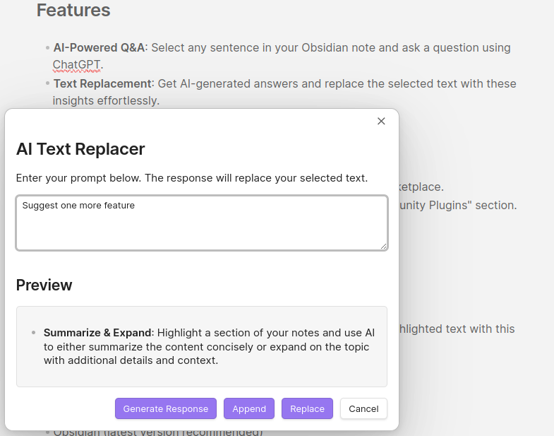

# Obsidian AI Writing Companion

Welcome to the Obsidian AI Plugin! This plugin integrates AI capabilities into your Obsidian workflow, enhancing your note-taking and information management experience.

## Features

- **AI-Powered Q&A**: Select any sentence in your Obsidian note and ask a question using ChatGPT.
- **Text Replacement**: Get AI-generated answers and replace the selected text with these insights effortlessly.

## Installation

1. Download the plugin from the Obsidian Community Plugins marketplace.
2. Enable the plugin within the Obsidian settings under the "Community Plugins" section.

## Usage

1. Highlight a sentence in your note.

2. Invoke the AI function to ask a question.

3. Receive an answer from ChatGPT and choose to replace the highlighted text with this new content.

## Requirements

- Obsidian (latest version recommended)
- OpenAI API Token with credits
- Stable internet connection for API access

## Feedback and Support

For issues or suggestions, please visit the [GitHub repository](https://github.com/Dref360) or contact support at support@your-email.com.

---

Enjoy the enhanced productivity with Obsidian AI Plugin!